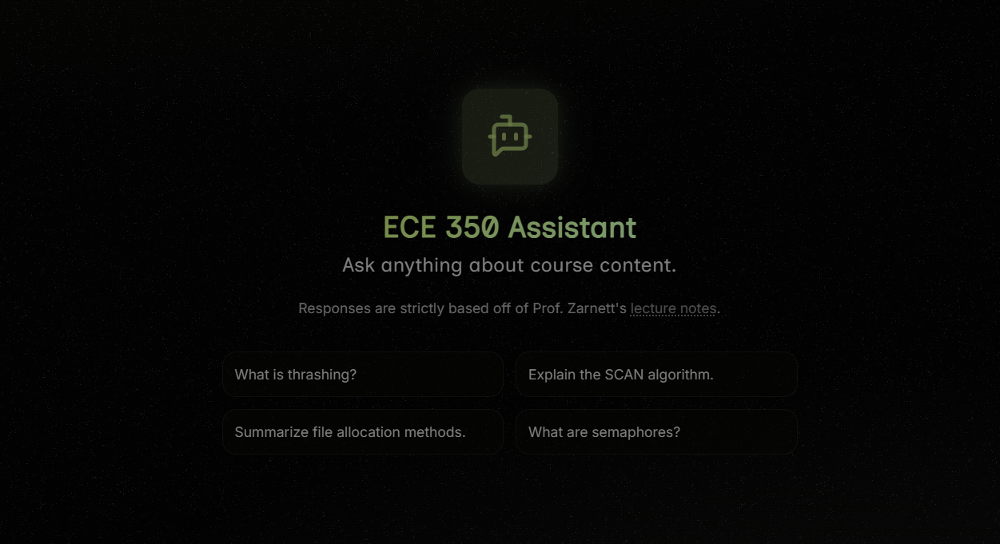

# ECE 350 RAG Assistant

A truly hallucination-free RAG chatbot knowledgable on University of Waterloo's Real-Time Operating Systems course (ECE 350). 

Provides grounded answers backed by exact lecture sources.



_Example RAG response - displays relevant sections from lecture notes with relevancy scores_

## Demo
**Try it live**: [ece350-assistant.vercel.app](https://ece350-assistant.vercel.app)

**Note**: To manage API costs, the demo is limited to 5 queries per day per user. 
Unfortunately this is a student project running on personal API credits. 

For unlimited usage:
- Run locally with your own OpenAI key (see [Installation](#installation))

I appreciate your understanding! 🙏

## Architecture

```
LaTeX files (server/lecs/L01.tex...L26.tex)
    ↓
[latex_parser.py] → lecture_chunks.json (200 chunks with metadata)
    ↓
[rag_pipeline.py] → embeddings.npy (OpenAI embeddings) → FAISS index
    ↓
User query → Vector search → Top-K chunks → GPT-4o-mini → Grounded answer
```

Every chunk keeps source traceability in the form of a hierarchy path (lecture # -> section -> subsection). This makes it easy to find where LLM generated info came from in the lecture notes.


## Core Files (in server/)

- **latex_parser.py**: Parses LaTeX files from `/lec` into embedding-ready chunks (50-token overlap)
- **rag_pipeline.py**: Embedding generation, [FAISS](https://github.com/facebookresearch/faiss) indexing, retrieval, LLM generation with structured responses
- **api.py**: Flask REST API wrapping the RAG pipeline
- **demo.py**: Interactive CLI interface to query RAG-enabled assistant

## Installation

### Prerequisites
- Python 3.10+
- Node.js 18+
- OpenAI API key ([get one here](https://platform.openai.com/api-keys))

### Backend Setup

```bash
cd server

# Install dependencies
pip install -r requirements.txt

# Configure environment
cp .env.example .env
# Edit .env and add your OPENAI_API_KEY
```

### Frontend Setup

```bash
cd client

# Install dependencies
npm install
```

## Usage

### Running the Full Application

```bash
# start the server
cd server
python api.py  # Runs on http://localhost:8000

# start the frontend dev server
cd client
npm run dev    # Runs on http://localhost:3000.
```

Open http://localhost:3000 in your browser to use the chat interface.

## Cost Notes

Cost info for local usage. Per 100 queries (with 5 chunks retrieved each):
- Embeddings: $0.002
- LLM calls: $0.035
- **Total**: ~$0.04/100 queries

## Acknowledgments

- Course material from [ECE 350](https://github.com/jzarnett/ece350/tree/main/lectures), University of Waterloo
- Built with OpenAI, FAISS, Flask, Next.js, and React-PDF